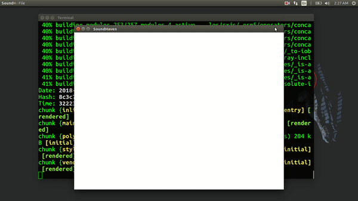

# SoundHaven

### Using Electron and Angular 6

Thanks to [@nunojesus](https://github.com/nunojesus) for this awesome Logo.

# Run app
* Clone the repository.
* `npm install`
* `npm run electron`

# Development
* For using the chrome inspector tools uncomment `win.webContents.openDevTools()` in the main.js file.

# Contributors
|  |  | |
 |
| ------------- |:-------------:| -----:|
| [Nityananda Gohain](https://github.com/nityanandagohain) | [Adirtha Borgohain](https://github.com/AdirthaBorgohain) | [Nuno Jesus](https://github.com/nunojesus) | [Sarthak Srivastava](https://github.com/SarthakSri98)

# Contribution
Contributors are more than welcome to contribute and suggest new ideas via issues. 

Gitter Channel : https://gitter.im/sound-haven/Lobby#
