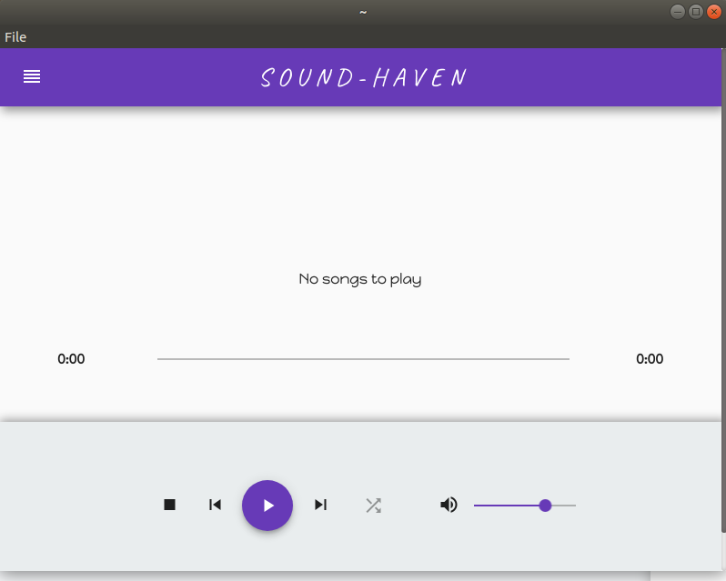
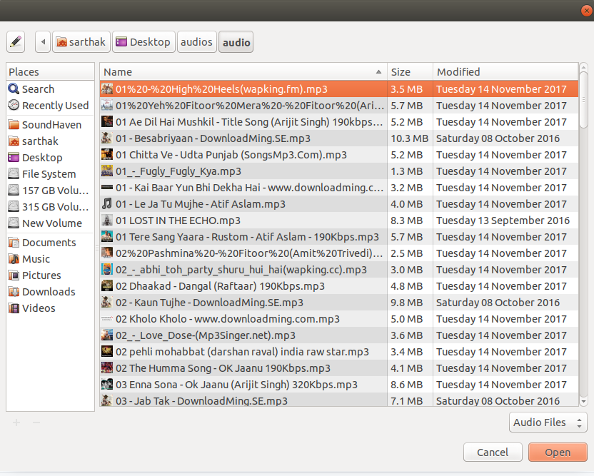
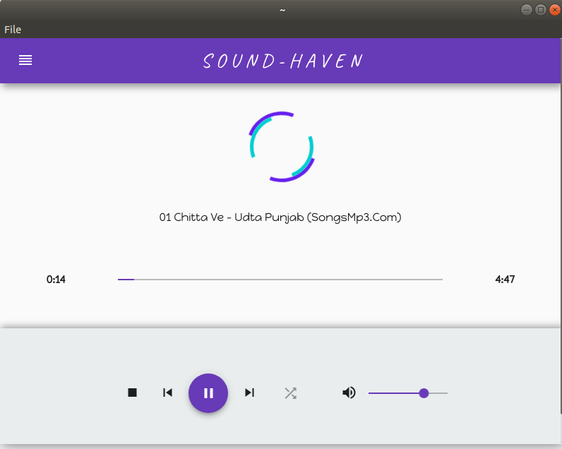
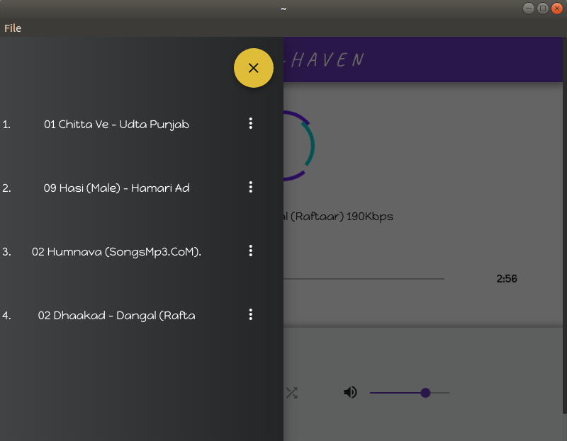
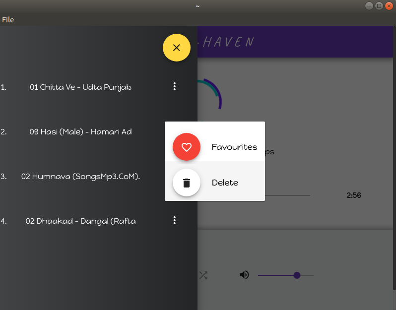

# SoundHaven

### Using Electron and Angular 6

Thanks to [@nunojesus](https://github.com/nunojesus) for this awesome Logo.

# Run app
* Clone the repository.
* `npm install`
* `npm run electron`

# Development
* For using the chrome inspector tools uncomment `win.webContents.openDevTools()` in the main.js file.

#Scenario 
1. This will be the first page. 

   
   
2. Then click on file on the tabs bar and you will get two options or use any of the shortcuts written on the right of the      below options
   * open folder (alt+O)
   * open file (ctrl+O)
   
   
   
3. Select the song from the opened folder.
   
   
   
4. The selected song will be played.

   
   
5. You can also see the selected song in the sidebar by clicking on the reorder.

   
   
6. If there are more than one song then you can select any of the song just by clicking on them and also delete any one of      them except the one which is playing at that time.  
   
   
   

# Contributors
|  |  | |
 |
| ------------- |:-------------:| -----:| -------|
| [Nityananda Gohain](https://github.com/nityanandagohain) | [Adirtha Borgohain](https://github.com/AdirthaBorgohain) | [Nuno Jesus](https://github.com/nunojesus) | [Sarthak Srivastava](https://github.com/SarthakSri98) |

# Contribution
Contributors are more than welcome to contribute and suggest new ideas via issues. 

Gitter Channel : https://gitter.im/sound-haven/Lobby#
